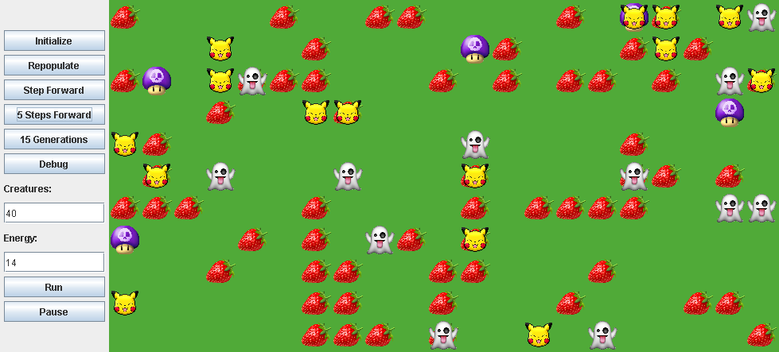

# Species Evolution
A genetic algorithm to optimise the fitness of a species of creatures in a simulated two-dimensional world. 

### About
_**The World**_

The world contains, placed at random; edible foods (Strawberries), poisonous Mushrooms, monsters (Ghosts) and a population of Creatures (Pikachu).

_**Learning**_

The creatures move around using energy, which can be replenished by eating food but the creatures can be eaten by monsters. Idealy the creatures will eat food and avoid predators and mushrooms, but this behaviour has to be learned through many generations of evolution. Through generations of evolution the algorithm should select for behaviours/chromosomes that keep the creatures well fed and not dead.

_**Repopulation**_

When a generation ends (Triggered when the population drops below a certain threshold) a new generation of creatures is created by combining the chromosomes (that define a creatures reponse to other entities in the world) of the surviving creatures with the highest energy levels. Through successive combination and mutation of chromosomes the creatures will learn how best to survive for extended periods of time.

### Clone & Run
1. Clone repo: `gti clone https://github.com/lenzoburger/SpeciesEvolution.git`
2. Launch Terminal/CMD
3. Change working directory `cd evolutionApp`
4. Compile `javac -d . *.java`
5. Run `java evolutionApp.CreateWorld`

### Development
#### Dependencies
1. [Java Development Kit](https://www.oracle.com/technetwork/java/javase/downloads/jdk8-downloads-2133151.html)

#### Tools
1. [Git](https://git-scm.com/downloads)
2. [Visual Studio Code](https://code.visualstudio.com/download) + **Extensions:**
   * [_Java Extension Pack_](https://marketplace.visualstudio.com/items?itemName=vscjava.vscode-java-pack)
   * [_vscode-pdf_](https://marketplace.visualstudio.com/items?itemName=tomoki1207.pdf)
   * [_Markdown All in One_](https://marketplace.visualstudio.com/items?itemName=yzhang.markdown-all-in-one)
   * [_Markdown Preview Enhanced_](https://marketplace.visualstudio.com/items?itemName=shd101wyy.markdown-preview-enhanced)
   * [_Meterial Icon Theme_](https://marketplace.visualstudio.com/items?itemName=PKief.material-icon-theme)
   * [_Path Intellisense_](https://marketplace.visualstudio.com/items?itemName=christian-kohler.path-intellisense)
#### Setup
1. Install [Java Development Kit](https://www.oracle.com/technetwork/java/javase/downloads/jdk8-downloads-2133151.html)
2. Ensure Java/JDK is included in PATH & set JAVA_HOME variable
3. [Clone & Run](#Clone--Run)
